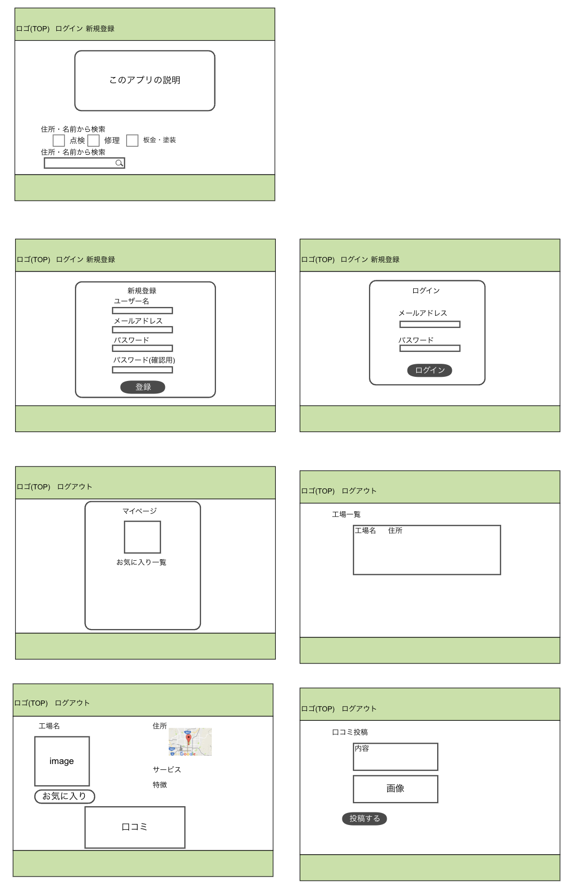
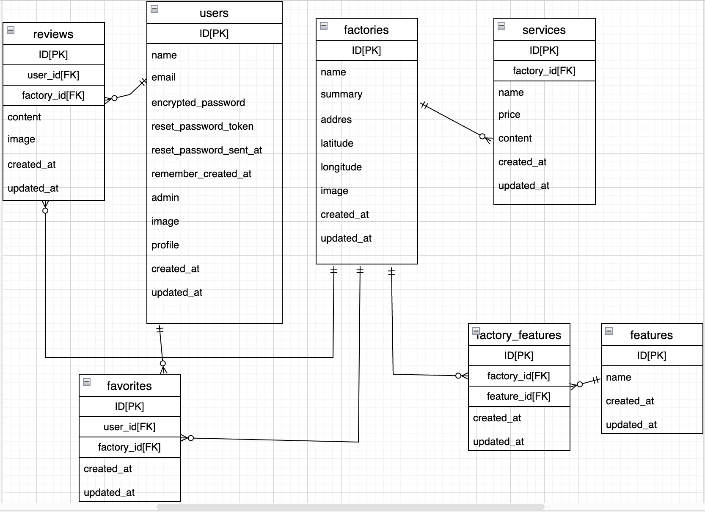
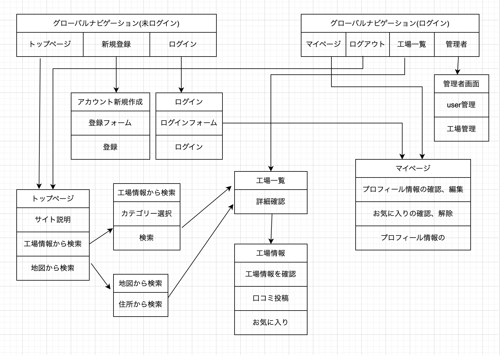

# README

# 開発言語
* Ruby3.0.1
* Rails6.1.6

<br>

# 就職Termの技術

* device
* rails_admin
* お気に入り機能


<br>

# カリキュラム外の技術
* ransack
* geocoder

<br>

# 実行手順
```
$ git clone git@github.com:fumiaki-hakozaki/original_app.git
$ cd original_app
$ bundle
$ rails db:create && rails db:migrate
$ rails s
```

<br>

# カタログ設計
https://docs.google.com/spreadsheets/d/1OYGy5V4kauishbhb5wcayya_JiIrBmpY3GaVAE3pc3s/edit#gid=1107408631

<br>

# テーブル定義書
https://docs.google.com/spreadsheets/d/1OYGy5V4kauishbhb5wcayya_JiIrBmpY3GaVAE3pc3s/edit#gid=1107408631

<br>

# ワイヤーフレーム


<br>

# ER図


<br>

# 画面遷移図

